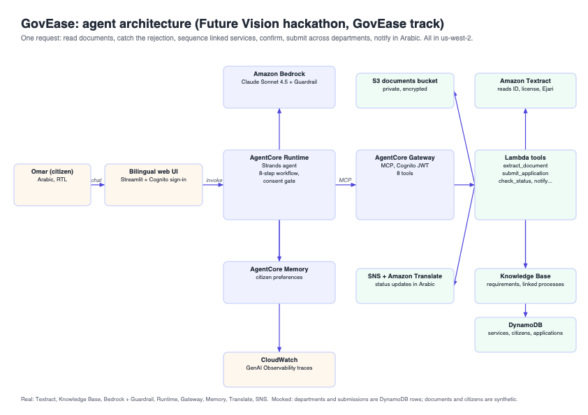

# GovEase: one conversation instead of four government visits

**Beneficiary.** Omar Haddad runs a bakery in Deira and has just moved it to Al Quoz. His trade license expires in 20 days. Last time he renewed, the application was rejected because his tax clearance certificate had quietly expired, which cost him four visits across three departments and three weeks.

**Measurable claim.** GovEase turns four department visits and one rejection cycle into a single confirmed conversation. It reads Omar's documents, catches the expired certificate and the address mismatch *before* anything is filed, sequences the three linked services in the right order, and submits them with his consent. Zero wasted trips, zero rejections.

Built for the Future Vision hackathon (GovEase track) on Amazon Bedrock AgentCore with Kiro.

## What the agent does

Given "I moved my bakery to Al Quoz and my trade license expires soon, renew it and update my address", the agent works through these steps on its own:

1. Loads the citizen's profile and preferred language (Arabic for Omar).
2. Retrieves the linked-process ordering rules and rejection reasons from the Knowledge Base.
3. Reads every uploaded document with **Amazon Textract**: Emirates ID, trade license, Ejari tenancy contract, tax clearance certificate. Each comes back with validity flags (expired, expiring within 30 days, fresh proof of address).
4. Finds two problems that would cause a rejection: the tax clearance expired 18 days ago, and the license still carries the Deira address.
5. Builds the plan in dependency order: tax clearance certificate, then address change, then trade license renewal. Total 170 AED, 12 business days, inside the 20-day window.
6. Asks for explicit consent. Submission is blocked until the citizen confirms.
7. Submits all three applications across three departments, returns tracking ids and expected dates, and notifies Omar in Arabic through **Amazon Translate** and SNS.
8. On later visits, checks status, flags overdue applications and recommends follow-up.

A request to backdate the certificate is refused cleanly.

## Architecture



| Layer | What we used |
| --- | --- |
| Interface | Bilingual, right-to-left web UI served by a Lambda function URL, with a simulated UAE PASS sign-in backed by Cognito (`web-ui/lambda/`). The runtime uses a Cognito JWT authorizer, so the UI calls it over HTTPS with the user's access token |
| Agent | Strands Agents SDK on **AgentCore Runtime**, Claude Sonnet 4.5 on Bedrock, baseline Bedrock Guardrail on input and output |
| Tools | Eight tools implemented once in `govease/core.py`. They run in-process in the deployed runtime, and the same code is packaged as a Lambda with a Gateway tool spec (`lambda_functions/`, `tool_specs/`), ready for **AgentCore Gateway** |
| Data | Seeded DynamoDB tables (services, citizens, applications), documents bucket on S3, Knowledge Base on S3 Vectors, SNS status topic |
| Memory | **AgentCore Memory** (user preferences) scoped per signed-in citizen |
| Observability | CloudWatch GenAI Observability traces of every tool call |

### Available tools

| Tool | Inputs | What it does |
| --- | --- | --- |
| `get_citizen_profile` | `citizen_id` | Returns the citizen's name, preferred language (`ar` or `en`) and contact. Called first |
| `list_services` | none | Lists every government service with its department, required documents, fee and processing time in business days |
| `search_service_policy` | `query` | Searches the requirements Knowledge Base for eligibility rules, linked-process ordering and rejection reasons |
| `list_citizen_documents` | `citizen_id` | Lists the PDFs under `citizens/<id>/` in the documents bucket, including any the citizen uploaded in the chat. Returns S3 keys |
| `extract_document` | `document_key` | Reads a PDF with Amazon Textract and returns its type, fields and validity flags (`EXPIRED`, `EXPIRES_WITHIN_30_DAYS`, `VALID`, `FRESH_PROOF_OF_ADDRESS`, `ISSUED_MORE_THAN_3_MONTHS_AGO`) |
| `submit_application` | `citizen_id`, `service_id`, `document_keys`, `citizen_confirmed`, `notes` (optional) | Submits an application and returns the tracking id and expected completion date. Final action: refused unless `citizen_confirmed` is `true` |
| `check_application_status` | `citizen_id` | Returns the citizen's applications with days open and whether each is overdue and needs a follow-up |
| `notify_citizen` | `citizen_id`, `message`, `language` (optional, `ar` or `en`) | Sends a status update through SNS, translated with Amazon Translate when needed |

Uploading a new document is not an agent tool. The web UI's `/upload-url` endpoint presigns an S3 upload, and the agent then reads the file with `extract_document`.

## Repository layout

```
GovEase/                     AgentCore project (created with `agentcore create`)
  app/GovEaseAgent/main.py   Runtime entry point: prompt, Gateway MCP client, Memory
  app/GovEaseAgent/govease/  Tool implementations (core.py), Strands wrappers, Textract parsing
  lambda_functions/govease/  Gateway Lambda handler (routes on bedrockAgentCoreToolName)
  tool_specs/govease.json    Gateway tool schema
  scripts/                   Sample document generator, seed and demo reset scripts
  data/samples/              Synthetic Dubai-flavoured PDFs for the demo citizen
web-ui/                      Bilingual RTL web interface pointed at the runtime
deliverables/                Architecture diagram, deck content, demo script, next steps
docs/                        Condensed workshop reference
.kiro/                       Kiro steering and MCP config
```

## Run it

Prerequisites: AWS credentials for the workshop account (us-west-2), AgentCore CLI, uv.

```bash
cd GovEase
./scripts/seed_extra.sh          # uploads Omar's documents, adds the tax clearance service
cd app/GovEaseAgent
uvx --from bedrock-agentcore-starter-toolkit agentcore deploy \
  --env AGENTCORE_MEMORY_ID=<memory id> --env GOVEASE_TOOL_MODE=local
uvx --from bedrock-agentcore-starter-toolkit agentcore invoke '{"prompt": "My citizen id is CIT-03. Renew my trade license and update my address."}'

cd ../web-ui/lambda && python local_server.py   # http://localhost:8502 (see web-ui/lambda/README.md for env vars)
```

Local development without the Gateway: `GOVEASE_TOOL_MODE=local uv run python main.py` inside `GovEase/app/GovEaseAgent` and POST to `/invocations` on port 8080.

Reset the demo between takes: `GovEase/scripts/reset_demo.sh`.

## What is real and what is mocked

Real: Textract extraction, Knowledge Base retrieval, Bedrock model and Guardrail, AgentCore Runtime, Memory, Translate, SNS. Mocked: departments and their submissions are rows in DynamoDB; all documents and citizens are synthetic; no real government API is called.

Deployment note: the workshop participant role cannot create the IAM roles that CDK bootstrap needs and is denied `bedrock-agentcore:CreateGateway`, so the runtime was deployed with the AgentCore starter toolkit (CodeBuild container build) and the tools run in-process. The Gateway Lambda (`workshop-govease-tools`) is deployed and tested directly; the agent switches to it automatically when a Gateway URL is present in its environment (`GOVEASE_TOOL_MODE=auto`).

## What we would build next

See [deliverables/what-we-would-build-next.md](deliverables/what-we-would-build-next.md). In short: real DET, Ejari and FTA integrations behind the same Gateway tools, UAE Pass sign-in, proactive follow-up from Memory, a Cedar policy that makes consent unbypassable, and evaluations that score "verified before submitting" on every session.

## Security notes

No credentials are committed. Resource identifiers are read from SSM Parameter Store at runtime. `cognito_config.json`, `.env.local` and the `credentials` file are gitignored. Extracted document fields are returned to the agent's working context only and are not logged.
